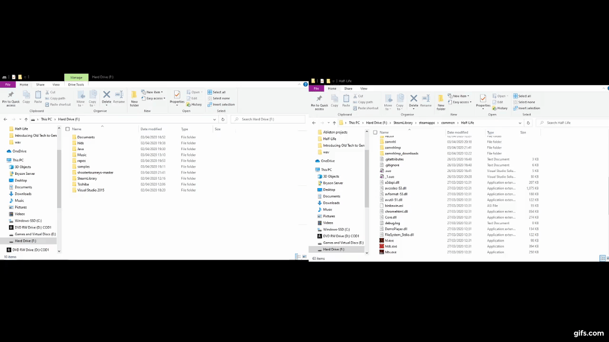

# Shooter Tourneys PUBLIC PLAYTEST
- For the source code, go to https://github.com/thephoenixprojectsoftware/shootertourneys
- For the manual, go to https://github.com/sabian-heatwave/shooter-tourneys-user-manual

# Installation Guide
1. Right click *Half-Life* in your Steam library. Go to **Properties** > **LOCAL FILES** > **BROWSE LOCAL FILES**
2. Create a folder called `zamnhlmp` If you want a stable public playtest, go to the [releases section](https://github.com/phoenixprojectsoftware/shootertourneys/releases) and skip step 3.
3. Clone this repository (using Git or the green **Clone or download** and then pressing **Download ZIP**) and with the files and folders in the `shootertourneys-master` folder, move them to the `zamnhlmp` folder you created.
#### Example:
